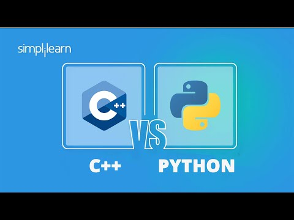
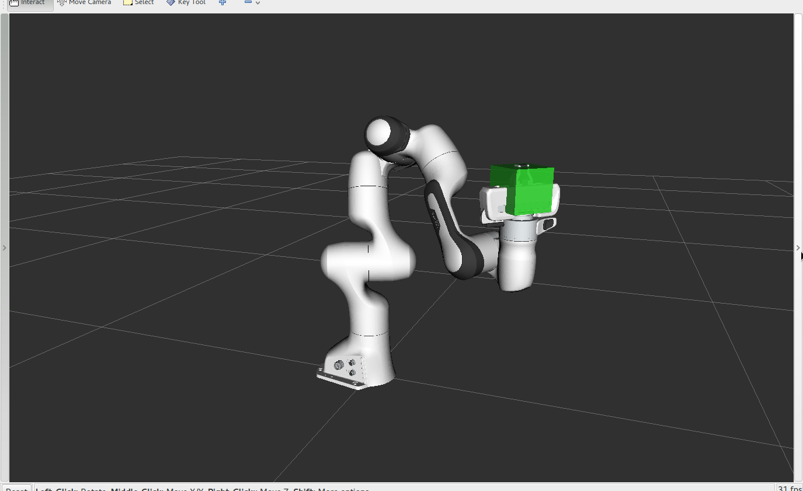
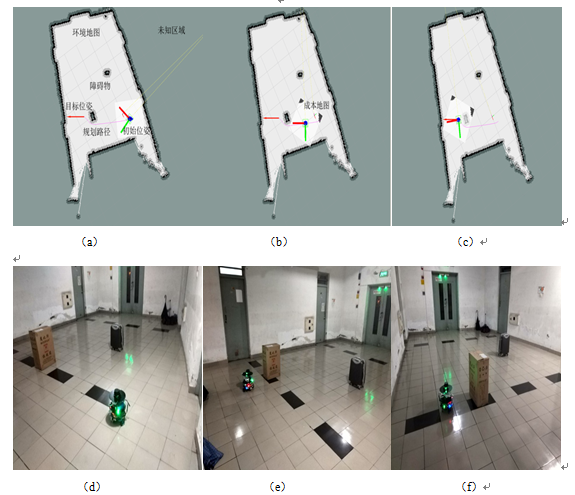

# Hello ROS!

### You are welcome to learn ROS. This tutorials will help you to start up.

### Firstly, we should figure out three questions. What is ROS? What ROS can do? Why we learn ROS?

### ROS is shorted for Robot Operating System. It's a highly flexible software architecture for writing robot software programs. It has four functions: communication mechanism, development tools, application function, and ecosystem.

### You've probably heard of lidar, trajectory planning, path planning, and more. OK， ROS can do all that.It's easier for us to get started.

### And then, I'll give you an easy learning route about ROS. 

### First of all, you must master a programming language, C++ or Python. As a beginner, I recommend studying more C++.

### If you like study by video, just follow the link below.

#### C++
[https://www.bilibili.com/video/BV1et411b73Z/?spm_id_from=333.337.search-card.all.click&vd_source=ef71a6f789d0a5b69f62e28630833356](https://www.bilibili.com/video/BV1et411b73Z/?spm_id_from=333.337.search-card.all.click&vd_source=ef71a6f789d0a5b69f62e28630833356)

#### Python

[https://www.bilibili.com/video/BV1qW4y1a7fU/?spm_id_from=333.337.search-card.all.click&vd_source=ef71a6f789d0a5b69f62e28630833356](https://www.bilibili.com/video/BV1qW4y1a7fU/?spm_id_from=333.337.search-card.all.click&vd_source=ef71a6f789d0a5b69f62e28630833356)

### But if you think text tutorials can help you more, just follow the link below.

#### C++

##### Google for C++
[https://developers.google.com/edu/c++/cpp-in-depth](https://developers.google.com/edu/c++/cpp-in-depth)

##### Rookie tutorials

[https://www.runoob.com/cplusplus/cpp-tutorial.html](https://www.runoob.com/cplusplus/cpp-tutorial.html)

#### Python

##### Python Official Website

[https://docs.python.org/3/tutorial/index.html](https://docs.python.org/3/tutorial/index.html)

##### Rookie tutorials
[https://www.runoob.com/python/python-tutorial.html](https://www.runoob.com/python/python-tutorial.html)

### Ok, when you master a language, you can move on to the next step. I recommend using Ubuntu20.04 to set up the ROS environment. At the same time, a dual system should be installed to operate. This will result in better performance than installing a virtual machine.

### It is recommended to allocate more than 80 GB of space to ubuntu for configuration, the following is the tutorial for installing ubuntu20.04 desktop dual system.

[https://blog.csdn.net/vor234/article/details/127083236?ops_request_misc=%257B%2522request%255Fid%2522%253A%2522169850437916800188543715%2522%252C%2522scm%2522%253A%252220140713.130102334.pc%255Fall.%2522%257D&request_id=169850437916800188543715&biz_id=0&utm_medium=distribute.pc_search_result.none-task-blog-2~all~first_rank_ecpm_v1~rank_v31_ecpm-4-127083236-null-null.142^v96^pc_search_result_base3&utm_term=ubuntu20.04%E5%AE%89%E8%A3%85%E6%A1%8C%E9%9D%A2%E5%8F%8C%E7%B3%BB%E7%BB%9F&spm=1018.2226.3001.4187](https://blog.csdn.net/vor234/article/details/127083236?ops_request_misc=%257B%2522request%255Fid%2522%253A%2522169850437916800188543715%2522%252C%2522scm%2522%253A%252220140713.130102334.pc%255Fall.%2522%257D&request_id=169850437916800188543715&biz_id=0&utm_medium=distribute.pc_search_result.none-task-blog-2~all~first_rank_ecpm_v1~rank_v31_ecpm-4-127083236-null-null.142^v96^pc_search_result_base3&utm_term=ubuntu20.04%E5%AE%89%E8%A3%85%E6%A1%8C%E9%9D%A2%E5%8F%8C%E7%B3%BB%E7%BB%9F&spm=1018.2226.3001.4187)

### If you want to learn CV, you can install OpenCV first, and try to choose version 4.6.0 or later. And next you should choose the ROS version according to the Ubuntu version to set up the environment

|    Ubuntu   |      ROS 1.0  | ROS 2.0 |
|    ---    |        ---     |    ---         |
|16.04 LTS|     Kinetic LTS |Ardent|
|18.04 LTS|Melodic LTS   |Dashing LTS|
|20.04 LTS|      	Noetic LTS     |Foxy LTS/ Galactic LST|

### I recommend setting up the Foxy environment because it has a lot of tutorials and it's easy to follow.

### This is a video introducing ROS on the official website,you can have a general idea of ROS

[https://www.ros.org/](https://www.ros.org/)

### Here are the instructions for the installation of the official Foxy as well as the teaching, You can learn simple tutorials on ROS nodes, topics, services, parameters, actions and so on.

[https://docs.ros.org/en/foxy/Installation.html](https://docs.ros.org/en/foxy/Installation.html)

#### "古月居社区"

[https://www.guyuehome.com/](https://www.guyuehome.com/)

#### "鱼香ROS"
[http://fishros.com/](http://fishros.com/)

#### "古月居ROS入门21讲视频"
[https://www.bilibili.com/video/BV16B4y1Q7jQ/?spm_id_from=333.337.search-card.all.click](https://www.bilibili.com/video/BV16B4y1Q7jQ/?spm_id_from=333.337.search-card.all.click)

### When you are proficient in the above content, you already have the ability to read ROS projects, and then you can choose the direction of in-depth research according to the specific practical projects. For example, perception positioning and path planning, robotic arm control, trajectory tracking, autonomous navigation, flight control development, etc.

#### "【公开课】古月精讲 · ROS移动机器人实战 | ROS入门必看"
[https://www.bilibili.com/video/BV1yT4y1Q76Q/?spm_id_from=333.999.0.0&vd_source=ef71a6f789d0a5b69f62e28630833356](https://www.bilibili.com/video/BV1yT4y1Q76Q/?spm_id_from=333.999.0.0&vd_source=ef71a6f789d0a5b69f62e28630833356)

#### "【古月居】ROS机器人开发实践"
[https://www.bilibili.com/video/BV1qL4y177Cv/?spm_id_from=333.999.0.0&vd_source=ef71a6f789d0a5b69f62e28630833356](https://www.bilibili.com/video/BV1qL4y177Cv/?spm_id_from=333.999.0.0&vd_source=ef71a6f789d0a5b69f62e28630833356)

#### "【开源项目】5分钟搞定机械臂开发和仿真环境，MoveIt！"
[https://www.bilibili.com/video/BV1Ru411e7kW/?spm_id_from=333.999.0.0&vd_source=ef71a6f789d0a5b69f62e28630833356](https://www.bilibili.com/video/BV1Ru411e7kW/?spm_id_from=333.999.0.0&vd_source=ef71a6f789d0a5b69f62e28630833356)

### Be sure to try to write, to do, to try, or you will have nothing left.